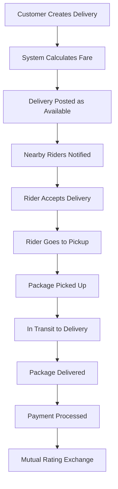

# Ryder Mtaani - Project Structure

## 🏗️ Architecture Overview

```
mtaani-ryder-web/
├── 📁 app/                          # Laravel Application Logic
│   ├── 📁 Http/
│   │   ├── 📁 Controllers/
│   │   │   ├── 📁 Api/             # API Controllers
│   │   │   │   ├── AuthController.php
│   │   │   │   ├── DeliveryController.php
│   │   │   │   ├── RiderController.php

│   │   │   ├── DashboardController.php
│   │   │   └── DeliveryController.php
│   │   └── 📁 Middleware/          # Custom Middleware
│   ├── 📁 Models/                  # Eloquent Models
│   │   ├── User.php               # Main user model (customers, riders, admins)
│   │   ├── RiderProfile.php       # Extended rider information

│   │   ├── Delivery.php          # Main delivery model
│   │   ├── DeliveryTracking.php  # GPS tracking data
│   │   └── OtpVerification.php   # OTP management
│   └── 📁 Providers/              # Service Providers
├── 📁 database/
│   ├── 📁 migrations/            # Database Schema
│   │   ├── *_add_user_types_to_users_table.php
│   │   ├── *_create_rider_profiles_table.php

│   │   ├── *_create_deliveries_table.php
│   │   ├── *_create_delivery_tracking_table.php
│   │   └── *_create_otp_verifications_table.php
│   └── 📁 seeders/              # Sample Data
│       └── RyderMtaaniSeeder.php
├── 📁 resources/
│   ├── 📁 js/                    # Frontend React Application
│   │   ├── 📁 components/        # Reusable UI Components
│   │   │   └── 📁 ui/           # Base UI Components (Shadcn/ui)
│   │   ├── 📁 pages/            # Page Components
│   │   │   ├── dashboard.tsx     # Main dashboard
│   │   │   └── 📁 deliveries/   # Delivery-related pages
│   │   │       ├── create.tsx   # Create delivery form
│   │   │       ├── index.tsx    # Delivery list
│   │   │       └── show.tsx     # Delivery details
│   │   ├── 📁 layouts/          # Page Layouts
│   │   ├── 📁 hooks/            # Custom React Hooks
│   │   ├── 📁 lib/              # Utility Functions
│   │   └── 📁 types/            # TypeScript Type Definitions
│   └── 📁 css/                  # Stylesheets
│       └── app.css              # Main Tailwind CSS file
├── 📁 routes/
│   ├── web.php                  # Web Routes (Inertia.js)
│   ├── api.php                  # API Routes (REST API)
│   └── auth.php                 # Authentication Routes
├── 📁 config/                   # Configuration Files
├── 📁 public/                   # Public Assets
├── 📁 storage/                  # File Storage & Logs
├── 📁 tests/                    # Automated Tests
├── .env.example                 # Environment Configuration Template
├── README.md                    # Project Documentation
├── DEPLOYMENT.md               # Deployment Guide
└── composer.json               # PHP Dependencies
```

## 🔧 Key Components

### Backend (Laravel)

#### Models & Relationships
- **User**: Base user model with polymorphic relationships
- **RiderProfile**: Extended rider data (vehicle, location, earnings)

- **Delivery**: Main delivery entity with comprehensive tracking
- **DeliveryTracking**: GPS tracking points and status updates
- **OtpVerification**: Phone number verification system

#### API Controllers
- **AuthController**: OTP-based authentication system
- **DeliveryController**: Full delivery lifecycle management
- **RiderController**: Rider-specific features (online status, earnings)
- **AdminController**: Administrative management features

#### Key Features
- 🔐 **OTP Authentication**: Secure phone-based login
- 📍 **GPS Tracking**: Real-time location tracking
- 💰 **Pricing Engine**: Dynamic fare calculation
- 📱 **Multi-user Types**: Customers, Riders, Administrators
- ⭐ **Rating System**: Bidirectional rating system
- 🚀 **Scalable Architecture**: Clean, maintainable code structure

### Frontend (React + TypeScript)

#### Page Structure
- **Dashboard**: Role-based dashboards for different user types
- **Delivery Management**: Create, track, and manage deliveries
- **User Profiles**: Complete profile management
- **Real-time Updates**: Live delivery tracking

#### UI Components
- Built with **Tailwind CSS** for styling
- **Radix UI** components for accessibility
- **Lucide React** icons for consistency
- Responsive design for mobile and desktop

## 🚀 Core Functionality

### For Customers
1. **Create Deliveries**: Multi-step delivery creation process
2. **Track Packages**: Real-time GPS tracking
3. **Payment Options**: Cash, Card, Mobile Money
4. **Rate Service**: Rate riders and provide feedback
5. **Delivery History**: Complete delivery history

### For Riders  
1. **Profile Setup**: Complete verification process
2. **Go Online/Offline**: Control availability
3. **Accept Deliveries**: Browse and accept nearby deliveries
4. **GPS Tracking**: Share location during deliveries
5. **Earnings Dashboard**: Track daily and total earnings
6. **Route Optimization**: Find efficient delivery routes

### For Administrators
1. **User Management**: Oversee customer and rider accounts
2. **Platform Analytics**: Monitor system-wide metrics
3. **Transaction Oversight**: Real-time financial monitoring
4. **System Configuration**: Manage platform settings
5. **Comprehensive Reporting**: Generate detailed insights

## 🔄 Delivery Workflow



## 📊 Database Schema

### Key Tables

#### users
- id, name, email, phone, user_type, rating, etc.
- Has one rider profile for riders

#### deliveries  
- Complete delivery information
- Pickup and delivery locations
- Package details and pricing
- Status tracking and ratings

#### rider_profiles
- Vehicle information
- Current location (GPS coordinates)
- Earnings and verification status
- Delivery radius preferences


#### delivery_tracking
- GPS tracking points
- Status updates with timestamps
- Notes and location data

## 🔒 Security Features

- **OTP Authentication**: Phone-based secure login
- **API Token Security**: Laravel Sanctum implementation
- **Input Validation**: Comprehensive request validation
- **Rate Limiting**: API abuse prevention
- **Data Encryption**: Sensitive data protection
- **CORS Configuration**: Secure cross-origin requests

## 📱 Mobile-Ready Design

### Progressive Web App (PWA) Ready
- Responsive design for all screen sizes
- Offline functionality capabilities
- Push notification support
- App-like user experience

### React Native Conversion Ready
- Component structure designed for reusability
- Separation of business logic and UI
- API-first architecture for easy mobile integration

## 🎯 Business Logic

### Pricing Algorithm
```
Base Fare: KES 100
+ Distance Rate: KES 20 per kilometer
= Subtotal
+ Service Fee: 15% of subtotal
= Total Fare

Rider Earnings: 85% of total fare
Platform Fee: 15% of total fare
```

### Delivery States
1. **Pending** → Waiting for rider acceptance
2. **Accepted** → Rider assigned, en route to pickup
3. **Picked Up** → Package collected from sender  
4. **In Transit** → Package being delivered
5. **Delivered** → Successfully delivered
6. **Cancelled** → Delivery cancelled (with reason)

## 🚀 Scalability Features

- **Queue System**: Background job processing
- **Caching Strategy**: Redis-based caching
- **Database Indexing**: Optimized queries for location and status
- **API Rate Limiting**: Prevent abuse and ensure fair usage
- **Horizontal Scaling**: Stateless architecture for easy scaling

## 🔧 Development Tools

- **Laravel Pail**: Real-time log monitoring
- **Laravel Telescope**: Application debugging (development)
- **ESLint + Prettier**: Code formatting and linting
- **TypeScript**: Type safety for frontend
- **Pest**: Modern PHP testing framework

This architecture provides a robust foundation for a scalable delivery management platform that can easily be extended with additional features or converted to a mobile application.